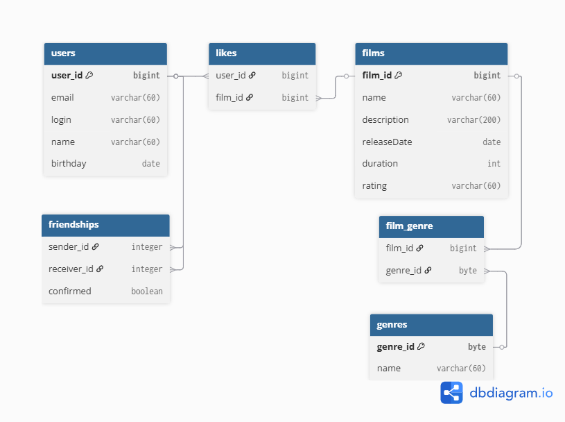

# Учебный проект java-filmorate.

  

## Запросы к БД
* получение списка всех фильмов
* получение списка всех пользователей
* добавление фильма в БД
* получение фильма по id
* добавление пользователя в БД
* получение пользователя по id
* получение списка топ фильмов по количеству лайков
* добавление дружбы в БД
* получение списка друзей пользователя
* получение списка друзей двух пользователей